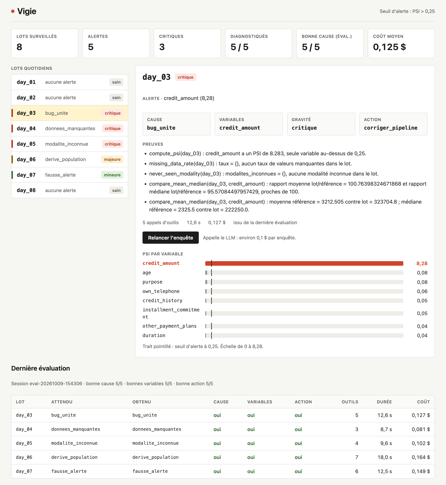
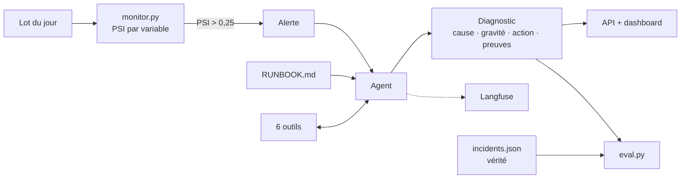

# Vigie

Un agent d'astreinte pour un modèle de machine learning en production. Quand une alerte de dérive se déclenche, l'agent enquête avec ses outils, trouve la cause et recommande une action. Chaque enquête est tracée dans Langfuse et évaluée sur des pannes injectées volontairement.



## Le problème

Le monitoring d'un modèle détecte qu'une variable a changé (PSI élevé), mais pas pourquoi. Derrière une même alerte, les situations sont opposées :

- un **bug dans le pipeline** (unité fausse, champ vide, valeur inconnue) : il faut corriger ;
- un **vrai changement des clients** sur des variables importantes : il faut réentraîner ;
- un **changement sans effet** sur le modèle : on peut ignorer.

Vigie fait ce tri avant l'humain, avec des preuves chiffrées. L'humain garde la décision.

## Fonctionnement



1. `monitor.py` calcule le PSI de chaque variable du lot et lève une alerte au-dessus de 0,25.
2. L'agent lit d'abord le runbook, puis appelle les outils dans l'ordre qu'il impose : causes techniques d'abord, importance pour le modèle ensuite.
3. Il rend un diagnostic structuré (Pydantic) : cause, variables, gravité, action et preuves.
4. `eval.py` compare chaque diagnostic à la vérité des pannes injectées.

## Évaluation

Cinq pannes injectées dans les lots 03 à 07 ; les lots 01, 02 et 08 restent sains.

| Lot | Panne injectée | Cause attendue | Action | Résultat | Outils | Durée | Coût |
|---|---|---|---|---|---|---|---|
| day_03 | `credit_amount` × 100 | `bug_unite` | corriger_pipeline | ✓ | 5 | 12,6 s | 0,13 $ |
| day_04 | 40 % de `duration` vide | `donnees_manquantes` | corriger_pipeline | ✓ | 3 | 8,7 s | 0,08 $ |
| day_05 | valeur inconnue dans `purpose` | `modalite_inconnue` | corriger_pipeline | ✓ | 4 | 9,6 s | 0,10 $ |
| day_06 | clients 8 ans plus âgés | `derive_population` | reentrainer_model | ✓ | 7 | 18,0 s | 0,16 $ |
| day_07 | `num_dependents` modifié, variable peu utilisée | `fausse_alerte` | ignorer | ✓ | 6 | 12,5 s | 0,15 $ |

**Score : 5 / 5** sur la cause, les variables et l'action. Coût estimé sans remise de cache, modèle `gpt-5.5`.

Le lot 07 est le cas clé : son PSI (1,84) est aussi élevé qu'une vraie panne, mais la variable ne compte presque pas pour le modèle. L'agent conclut qu'il n'y a rien à faire.

## Lancer le projet

```bash
python -m venv .venv && source .venv/bin/activate
pip install -r requirements.txt
```

Créer un fichier `.env` :

```
OPENAI_API_KEY=...
LANGFUSE_PUBLIC_KEY=...
LANGFUSE_SECRET_KEY=...
LANGFUSE_BASE_URL=https://cloud.langfuse.com
```

Puis, depuis la racine du projet :

```bash
python make_data.py      # référence, réserve et 8 lots quotidiens
python inject.py         # 5 pannes et data/incidents.json
python train.py          # modèle et importance des variables
python monitor.py        # data/alerts.json

python investigate.py day_07   # une enquête
python eval.py                 # les 5 enquêtes, comparées à la vérité
uvicorn api:app --reload       # dashboard sur http://127.0.0.1:8000
```

## Structure

| Fichier | Rôle |
|---|---|
| `make_data.py` | Télécharge credit-g (OpenML), sépare 600 lignes de référence et 400 de réserve, tire 8 lots de 250 lignes |
| `inject.py` | Injecte les pannes et écrit leur vérité |
| `train.py` | Forêt aléatoire (AUC 0,81) et importance des variables par permutation |
| `psi.py` | PSI : bacs par quantiles fixés sur la référence, bac « autre » et bac « manquant » |
| `monitor.py` | Détecte les dérives au-dessus du seuil |
| `tools.py` | Les 6 outils de l'agent |
| `RUNBOOK.md` | La procédure d'enquête, suivie par l'agent comme par un humain |
| `agent.py` | L'agent LangChain, son prompt et le schéma du diagnostic |
| `investigate.py` | Lance une enquête depuis le terminal |
| `eval.py` | Évalue l'agent : exactitude, nombre d'outils, durée, coût |
| `api.py`, `static/` | API FastAPI et dashboard |

## Choix techniques

- **Pannes injectées** : en production, on ne connaît jamais la cause à l'avance. Fabriquer des pannes connues est le seul moyen de mesurer l'agent.
- **Runbook hors du prompt** : la procédure existe à un seul endroit, versionnée et lisible par un humain.
- **Sortie structurée** : les valeurs autorisées sont imposées par le schéma Pydantic, ce qui rend l'évaluation automatique.
- **Preuves chiffrées** : chaque conclusion cite l'outil et la valeur qui la justifient.
- **Langfuse pour le développeur, dashboard pour l'astreinte** : le détail de chaque appel d'un côté, la décision à prendre de l'autre.

## Limites

- Cinq cas d'évaluation, nets et synthétiques. Les vraies pannes sont plus ambiguës.
- Chaque cas n'est lancé qu'une fois, alors qu'un LLM n'est pas déterministe.
- Pas encore de comparaison avec une approche par règles codées à partir du runbook.
- Les seuils (PSI, importance) sont réglés à la main sur ce jeu de données.
- L'agent recommande, il n'agit pas.

## Stack

Python 3.13 · pandas · scikit-learn · LangChain · OpenAI · Pydantic · Langfuse · FastAPI
